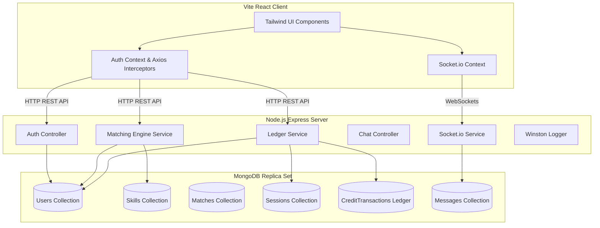

# SkillSwap: Peer-to-Peer Skill Bartering Platform

SkillSwap is a professional, portfolio-grade MERN stack application where users exchange talents and services using a time-credit system instead of money. Teach for 1 hour, earn 1 credit; spend that credit to learn from others. The platform features dynamic matching suggestions, real-time Socket.io chat/notifications, and a transaction-safe double-entry ledger.

---

## 1. System Architecture



---

## 2. Setup & Execution Instructions

### Option A: Run with Docker (Recommended)
This runs the entire stack, including a single-node MongoDB Replica Set that automatically initializes itself to support database transactions.

1.  Clone the repository and ensure you have Docker Desktop running.
2.  Execute the following command in the root directory:
    ```bash
    docker-compose up --build
    ```
3.  The client app will be available at [http://localhost](http://localhost) (Port 80) and the backend API at [http://localhost:5000](http://localhost:5000).

---

### Option B: Run Locally
To run locally, you need a local MongoDB instance running.

#### 1. Setup Backend
1.  Navigate to the `/server` folder:
    ```bash
    cd server
    ```
2.  Install dependencies:
    ```bash
    npm install
    ```
3.  Create a `.env` file based on `.env.example`:
    ```bash
    cp .env.example .env
    ```
4.  Seed the default skill categories and items:
    ```bash
    npm run seed
    ```
5.  Start the development server:
    ```bash
    npm run dev
    ```

#### 2. Setup Frontend
1.  Navigate to the `/client` folder:
    ```bash
    cd ../client
    ```
2.  Install dependencies:
    ```bash
    npm install
    ```
3.  Start the Vite dev server:
    ```bash
    npm run dev
    ```
4.  Open [http://localhost:5173](http://localhost:5173) in your browser.

---

## 3. Engineering Decisions

### A. The Matching Engine Scoring Formula
I designed a multi-factor matching formula to calculate matching scores between users. Given User A (learner) and User B (potential teacher), the score is computed as:

$$\text{Score} = (3.0 \times S_{\text{skill}}) + (2.0 \times S_{\text{rating}}) + (1.0 \times S_{\text{avail}}) + S_{\text{mutual}} + S_{\text{motivation}}$$

#### Why I Weighted It This Way:
*   **Skill Relevance ($S_{\text{skill}}$, Weight = 3.0):** This is the core utility of the app. It sums B's proficiency levels (Beginner=1, Intermediate=2, Expert=3) for skills matching A's learning goals. This ensures highly qualified mentors rank highest.
*   **Rating ($S_{\text{rating}}$, Weight = 2.0):** Rewards quality. We use B's average review rating, defaulting to a neutral `4.0` for new users so they aren't penalized.
*   **Availability ($S_{\text{avail}}$, Weight = 1.0):** Overlapping calendar slots are calculated by checking intersecting minutes. It is capped at 5 slots to prevent wide schedules from skewing the primary skill-matching factor.
*   **Mutual Match Boost ($S_{\text{mutual}} = +10.0$):** If B wants to learn a skill A teaches, it forms a perfect barter loop. I added a significant boost (+10 pts) to surface these mutual matches immediately.
*   **Motivation Boost ($S_{\text{motivation}} = +2.0$):** Users with low credit balances ($\le 2$ credits) get a boost, raising their visibility so they can teach sessions, earn credits, and remain active on the platform.

---

### B. Double-Spend & Ledger Consistency
To ensure users cannot double-spend credits or drive their balances below zero, I implemented a double-entry style ledger. Balances are not just incremented; every change creates an immutable transaction entry linked to a tutoring session.

I combined **MongoDB ACID multi-document transactions** with **atomic filter constraints**. 

When a session is accepted (credits reserved in escrow) or completed (transferred to the teacher), the ledger service executes the database writes within a transaction session (`session.startTransaction()`). 
To guarantee thread-safety under concurrent requests, we perform the balance decrement with a query constraint:
```javascript
const updatedUser = await User.findOneAndUpdate(
  { _id: learnerId, creditBalance: { $gte: 1 } },
  { $inc: { creditBalance: -1 } },
  { session, new: true }
);
```
MongoDB's document-level locks ensure that if two booking requests are submitted simultaneously, they execute sequentially. The first succeeds and decrements the balance to `0`. The second request's `{ creditBalance: { $gte: 1 } }` filter fails, returning `null`, which aborts the transaction and rolls back all modifications.

---

### C. A Hard Bug & How I Solved It
During early development of the ledger system, I noticed that concurrent requests to confirm two different sessions for a user with exactly `1` credit would sometimes *both* succeed, resulting in a credit balance of `-1`. 

I realized this occurred because the check and the update were separated. The code originally checked the balance in Javascript first (`if (user.creditBalance >= 1)`), and then executed the update. In concurrent tests, both asynchronous requests checked the database and read the balance as `1` before either update completed.

To fix this, I refactored the logic to perform the validation and update **in a single atomic MongoDB operation** using `findOneAndUpdate` with a query filter constraint. By including the condition `creditBalance: { $gte: 1 }` directly in the query, MongoDB performs the check and update atomically at the database engine level. This completely eliminated the race condition.

---

### D. Scalability Considerations
If this platform were to scale to millions of active users, I would implement:
1.  **Timezone-Aware Geo-Matching:** Store locations as GeoJSON coordinates, adding a distance penalty to the matching score or filtering matches to a specific timezone delta.
2.  **Skill Badging & Verification:** Add verification tests, portfolio reviews, or peer-verification badges to validate proficiency levels.
3.  **Group Sessions:** Allow teachers to host group sessions, dividing the credit cost among multiple learners (e.g. 5 learners pay 0.2 credits each for a 1-hour session).

---

## 4. Key Performance Metrics to Measure

1.  **Matching Engine Query Latency:**
    *   *Metric:* Average time to compute suggestions for a user.
    *   *Target:* `< 50ms` at 10,000 users. Optimizations include compound indexing on `skillsToTeach.skill` and `skillsToLearn.skill`.
2.  **Concurrent Session-Completion Throughput:**
    *   *Metric:* Successfully processed completion requests per second without database locks or deadlocks.
    *   *Target:* `100+ requests/sec`. Ensured by keeping MongoDB transactions short and scoping document locks tightly to specific user IDs.
3.  **Search Query Latency:**
    *   *Metric:* Full-text search response time for skill queries.
    *   *Target:* `< 20ms` using MongoDB text indexing.
